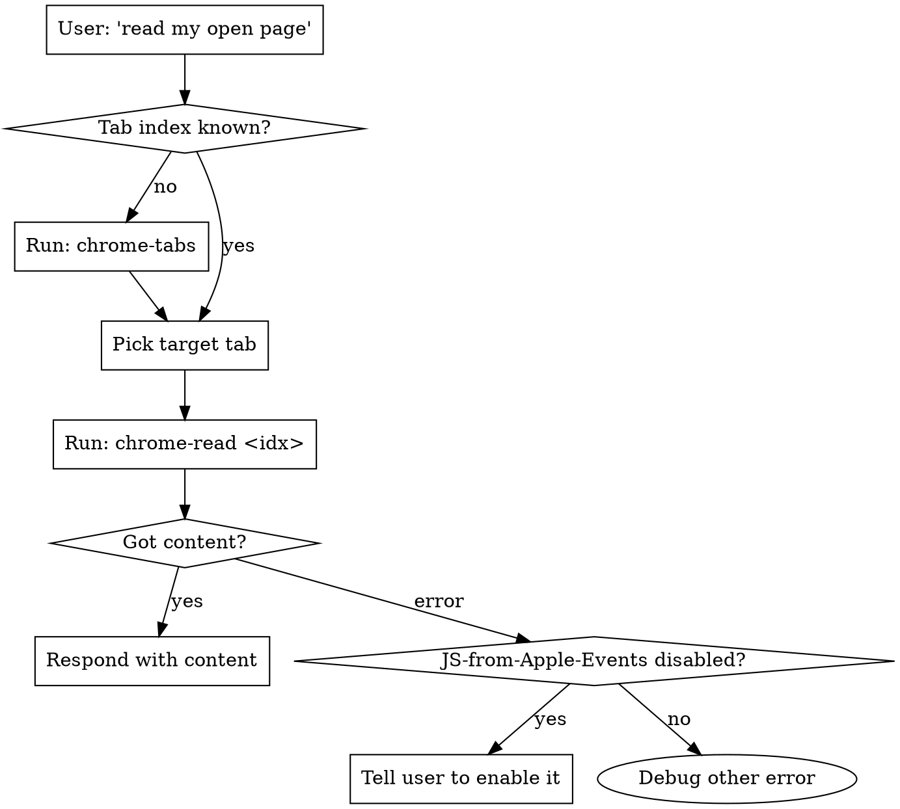

# chrome-html-read

## Overview

Read content from **the user's currently-open Chrome tabs** and bring it into the conversation — no scraping, no headless browser, no re-login. Powered by macOS AppleScript + Chrome's "Allow JavaScript from Apple Events" feature.

**Core principle:** The user already has the page open and authenticated. Don't fetch it again — read it directly from their live browser via `osascript`.

## When to Use

**Use when:**
- "Read the page I have open" / "看看我打开的这个页面"
- "Summarize my current tab" / "总结一下我现在看的网页"
- "What tabs do I have open?" / "我开了哪些网页"
- "Search my open tabs for X" / "在我打开的网页里搜一下"
- User references content only visible in *their* browser (logged-in dashboards, internal tools, paid docs)
- Need to extract data that requires the user's session/cookies

**Do NOT use for:**
- Public URLs that work fine with WebFetch / curl (just fetch them)
- Headless automation / form filling (this is read-only)
- Non-Chrome browsers (Safari/Edge/Firefox — different AppleScript dictionaries)
- Headless CI environments (no GUI Chrome running)

## Prerequisites

**One-time Chrome setup (user must do this manually):**

Chrome menu bar → **View → Developer → Allow JavaScript from Apple Events**

If skipped, every read returns:
```
"通过 AppleScript 执行 JavaScript 的功能已关闭"
```

Tell the user to enable it, then retry.

## Quick Reference

| Task | Command |
|------|---------|
| List all tabs | `chrome-tabs` |
| List only URLs | `chrome-tabs --urls` |
| Filter tabs by keyword | `chrome-tabs "github"` |
| List as JSON | `chrome-tabs --json` |
| Read tab by index | `chrome-read 2.3` |
| Read tab by keyword | `chrome-read "browser-use"` |
| Read raw HTML | `chrome-read 2.3 html` |
| Read + copy to clipboard | `chrome-read 2.3 --copy` |
| Truncate for LLM | `chrome-read 2.3 --max 8000` |
| Search all tabs | `chrome-search "login"` |

## Core Workflow



### Step 1: Discover what's open

```bash
chrome-tabs
```

Output format:
```
[1.5]  browser-use/browser-use: 🌐 Make websites...
    https://github.com/browser-use/browser-use/tree/main
```

The `[1.5]` = window 1, tab 5. Use this index for reading.

### Step 2: Read the target tab

```bash
# By index (most reliable)
chrome-read 1.5

# By keyword (first match on URL or title)
chrome-read "browser-use"

# When feeding to an LLM, truncate to avoid token explosion
chrome-read 1.5 --max 8000
```

### Step 3: Use the content

The output is plain `innerText` of the page body (script/style/svg stripped). Use it directly in your response, or pipe through summarization.

## Recommended Patterns

### Pattern: "Read this page I'm looking at"

When the user says "summarize the page I have open" without specifying which:

1. Run `chrome-tabs` to see all open tabs
2. If only one non-trivial tab → read it
3. If multiple candidates → **show the list and ask which one** (don't guess)
4. Read with `chrome-read <idx> --max 8000`
5. Summarize

```bash
chrome-tabs              # show options
chrome-read 1.5 --max 8000   # user picks, then read
```

### Pattern: Search across many tabs

When user asks "which of my tabs mentions X?":

```bash
chrome-search "Tuya"          # finds X across ALL open tabs, with context
chrome-search "error" --urls  # just the matching URLs
```

Faster than reading each tab individually.

### Pattern: Feeding large pages to LLMs

Raw HTML of a modern SPA can be 500KB+. Always cap it:

```bash
# Good: text + truncation
chrome-read 2.3 --max 8000

# Bad: dumps entire HTML, blows up context
chrome-read 2.3 html
```

Only use `html` mode when the user explicitly needs markup (selectors, structure).

## Common Mistakes

| Mistake | Fix |
|---------|-----|
| `execute javascript` returns "功能已关闭" | User hasn't enabled "Allow JavaScript from Apple Events". Tell them the menu path. |
| Reading wrong tab after user switches | Tab indices change as tabs open/close. Always re-run `chrome-tabs` if in doubt. |
| `chrome-read "github"` matches wrong tab | Keyword matches first hit in window order. Use exact index when precision matters. |
| Giant output crashes context | Always pass `--max N` for non-trivial pages. |
| Trying to read a tab in a minimized window | Works, but if it fails, have user focus the window first. |
| Assuming Safari works the same | Safari's AppleScript dict differs. This skill is Chrome-only. |

## Implementation Notes

- **Read-only.** These scripts never click, type, or navigate. Safe to use on sensitive pages.
- **No network calls.** Content comes from the live DOM via AppleScript, not a re-fetch.
- **Uses the user's session.** Logged-in pages (Gmail, internal dashboards) work without re-auth.
- **Cross-window.** Iterates all Chrome windows, not just the frontmost one.

## Installation

If the `chrome-*` commands aren't on PATH, install from the repo:

```bash
git clone https://github.com/freedom-shen/chrome-html-read.git
cd chrome-html-read
./install.sh
```

`install.sh` copies scripts to `~/.local/bin` and registers this skill with both:
- `~/.claude/skills/chrome-html-read/` (Claude Code)
- `~/.agents/skills/chrome-html-read/` (Codex / ZCode)
