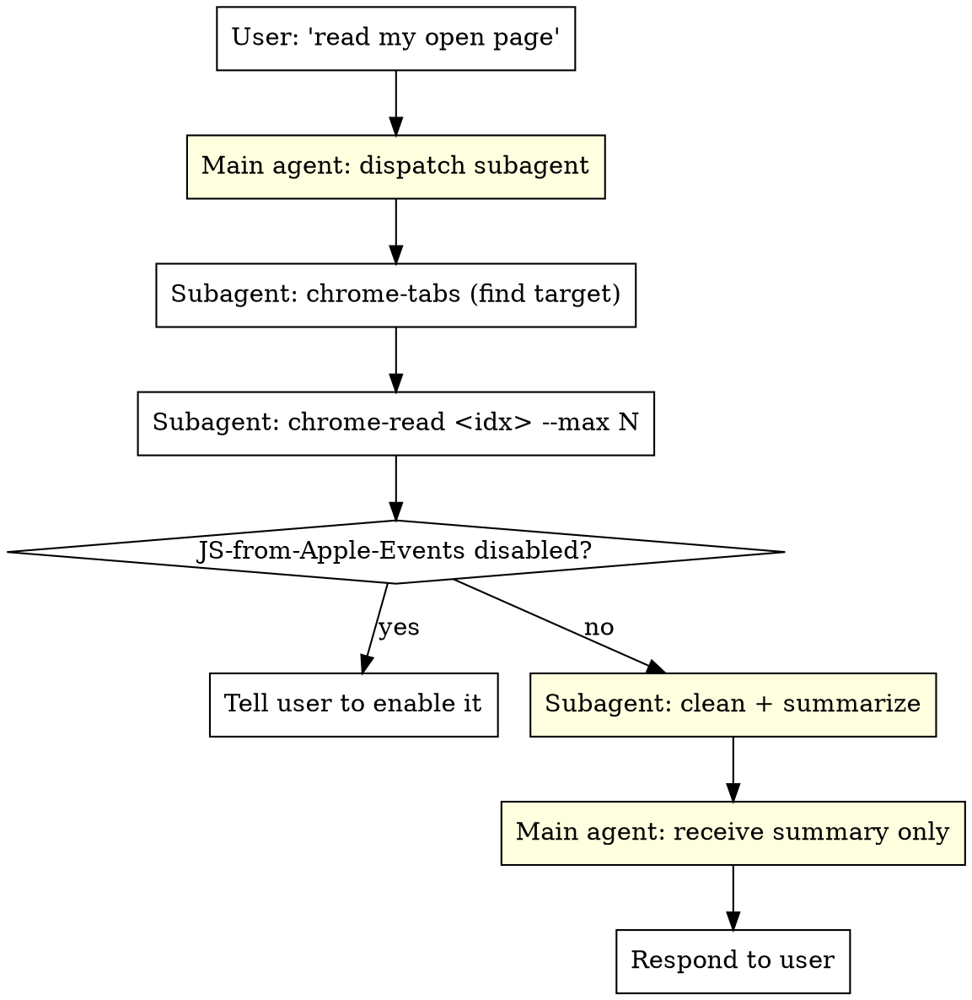

# chrome-html-read

## Overview

Read content from **the user's currently-open Chrome tabs** and bring it into the conversation — no scraping, no headless browser, no re-login. Powered by macOS AppleScript + Chrome's "Allow JavaScript from Apple Events" feature.

**Core principles:**

1. **The user already has the page open and authenticated.** Don't fetch it again — read it directly from their live browser via `osascript`.
2. **Raw web content is toxic to your context.** HTML/CSS/JS noise is huge, low-signal, and drowns reasoning. **ALWAYS** read as cleaned text (the `chrome-read` default), never raw HTML unless the user explicitly asks for markup.
3. **ALWAYS read via a subagent.** Webpage dumps are 10KB–500KB. Pulling that into your main context pollutes it for the entire conversation. Dispatch a subagent to fetch + clean + return only the summary or extracted facts.

## Iron Rule: Subagent + Cleaned Text

```
NO READING RAW WEB CONTENT INTO THE MAIN CONTEXT
```

- **Read via subagent.** The main agent dispatches; the subagent runs `chrome-read` and returns a compressed result (summary / extracted fields / short quote), NOT the full page.
- **Default to `text` mode** (already strips `<script> <style> <noscript> <svg> <link> <template> <iframe>`).
- **Always pass `--max`.** Even cleaned text from a big page can be 100KB+. Cap it.
- **Use `html` mode ONLY** when the user needs selectors, structure, or raw markup.

## When to Use

**Use when:**
- "Read the page I have open" / "看看我打开的这个页面"
- "Summarize my current tab" / "总结一下我现在看的网页"
- "What tabs do I have open?" / "我开了哪些网页"
- "Search my open tabs for X" / "在我打开的网页里搜一下"
- User references content only visible in *their* browser (logged-in dashboards, internal tools, paid docs)
- Need to extract data that requires the user's session/cookies

**Do NOT use for:**
- Public URLs that work fine with WebFetch / curl (just fetch them)
- Headless automation / form filling (this is read-only)
- Non-Chrome browsers (Safari/Edge/Firefox — different AppleScript dictionaries)
- Headless CI environments (no GUI Chrome running)

## Prerequisites

**One-time Chrome setup (user must do this manually):**

Chrome menu bar → **View → Developer → Allow JavaScript from Apple Events**

If skipped, every read returns:
```
"通过 AppleScript 执行 JavaScript 的功能已关闭"
```

Tell the user to enable it, then retry.

## Quick Reference

| Task | Command |
|------|---------|
| List all tabs | `chrome-tabs` |
| List only URLs | `chrome-tabs --urls` |
| Filter tabs by keyword | `chrome-tabs "github"` |
| List as JSON | `chrome-tabs --json` |
| Read tab by index | `chrome-read 2.3` |
| Read tab by keyword | `chrome-read "browser-use"` |
| Read raw HTML | `chrome-read 2.3 html` |
| Read + copy to clipboard | `chrome-read 2.3 --copy` |
| Truncate for LLM | `chrome-read 2.3 --max 8000` |
| Search all tabs | `chrome-search "login"` |

## Core Workflow



**The main agent NEVER runs `chrome-read` directly for content >1KB.** It dispatches a subagent. The subagent reads, strips noise, and returns only what the main agent needs (a summary, extracted data, or a short verbatim quote). The full page text never touches the main context.

### Step 1: Discover what's open

```bash
chrome-tabs
```

Output format:
```
[1.5]  browser-use/browser-use: 🌐 Make websites...
    https://github.com/browser-use/browser-use/tree/main
```

The `[1.5]` = window 1, tab 5. Use this index for reading.

### Step 2: Read the target tab

```bash
# By index (most reliable)
chrome-read 1.5

# By keyword (first match on URL or title)
chrome-read "browser-use"

# When feeding to an LLM, truncate to avoid token explosion
chrome-read 1.5 --max 8000
```

### Step 3: Use the content

The output is plain `innerText` of the page body (script/style/svg stripped). Use it directly in your response, or pipe through summarization.

## Recommended Patterns

### Pattern: "Read this page I'm looking at" (CANONICAL — uses subagent)

When the user says "summarize the page I have open" — **always go through a subagent** so the page content stays out of your main context:

1. **Main agent:** dispatch a subagent with this task.
2. **Subagent:** runs `chrome-tabs`, picks the right tab (asks back only if ambiguous), then runs `chrome-read <idx> --max 8000`.
3. **Subagent:** cleans the text and returns **only the result** (summary / extracted fields / short quote ≤ 2000 chars). Does NOT echo the raw page back to the main agent.
4. **Main agent:** responds to the user using the summary.

**Main agent dispatch template (subagent_type=Explore):**

```
Read the user's currently-open Chrome tab about "<topic>".
1. Run `chrome-tabs` to list open tabs. Pick the most relevant one
   (if multiple look plausible, list the candidates and stop — ask me which).
2. Run `chrome-read <idx> --max 8000` to get cleaned text (CSS/scripts already stripped).
3. Do NOT return the full page text. Return ONLY:
   - a 5-bullet summary, OR
   - the specific facts I asked for, OR
   - a ≤500-char verbatim quote if I asked for exact text.
4. If `chrome-read` errors with "功能已关闭", stop and tell me the user
   needs to enable View → Developer → Allow JavaScript from Apple Events.
```

> **Why subagent:** `chrome-read` output is typically 5KB–100KB. Loading that into the main context for a multi-turn task burns 50%+ of usable context and degrades reasoning. A subagent reads, digests, and returns kilobytes-of-summary instead of tens-of-kilobytes-of-raw.

### Pattern: When the main agent CAN run `chrome-read` directly

Only when ALL of these hold:
- The user explicitly wants the raw text in the conversation (e.g., "paste me the content")
- You're confident the page is small (<3KB, e.g., a short article or a snippet)
- It's a one-shot read, not part of a longer reasoning task

Otherwise → subagent.

### Pattern: Search across many tabs (still subagent)

When user asks "which of my tabs mentions X?":

```bash
# Inside subagent:
chrome-search "Tuya"          # finds X across ALL open tabs, with context
chrome-search "error" --urls  # just the matching URLs
```

Subagent returns the **list of matching tab titles + URLs** (a few hundred bytes), not the full search dump.

### Pattern: Feeding large pages to LLMs

Even via subagent, cap the read. SPA pages can be 500KB+:

```bash
# Good: cleaned text + truncation (default behavior)
chrome-read 2.3 --max 8000

# Bad: dumps entire HTML, blows up even the subagent's context
chrome-read 2.3 html
```

## Common Mistakes

| Mistake | Fix |
|---------|-----|
| **Reading page content into the MAIN context** | **Always dispatch a subagent.** Main context is for reasoning, not for 50KB page dumps. The subagent returns a summary. |
| **Omitting `--max`** | Always pass `--max N` (default 8000). Without it, a single big page can exhaust the subagent's own context. |
| **Using `html` mode by default** | Don't. `html` returns CSS/JS noise. Default is cleaned `text` — keep it that way unless user wants markup. |
| `execute javascript` returns "功能已关闭" | User hasn't enabled "Allow JavaScript from Apple Events". Tell them the menu path. |
| Reading wrong tab after user switches | Tab indices change as tabs open/close. Always re-run `chrome-tabs` if in doubt. |
| `chrome-read "github"` matches wrong tab | Keyword matches first hit in window order. Use exact index when precision matters. |
| Trying to read a tab in a minimized window | Works, but if it fails, have user focus the window first. |
| Subagent echoing full page back to main agent | The subagent must **compress** (summary / extracted facts / short quote), not relay raw text. This defeats the whole point. |
| Assuming Safari works the same | Safari's AppleScript dict differs. This skill is Chrome-only. |

## Implementation Notes

- **Read-only.** These scripts never click, type, or navigate. Safe to use on sensitive pages.
- **No network calls.** Content comes from the live DOM via AppleScript, not a re-fetch.
- **Uses the user's session.** Logged-in pages (Gmail, internal dashboards) work without re-auth.
- **Cross-window.** Iterates all Chrome windows, not just the frontmost one.

## Installation

If the `chrome-*` commands aren't on PATH, install from the repo:

```bash
git clone https://github.com/freedom-shen/chrome-html-read.git
cd chrome-html-read
./install.sh
```

`install.sh` copies scripts to `~/.local/bin` and registers this skill with both:
- `~/.claude/skills/chrome-html-read/` (Claude Code)
- `~/.agents/skills/chrome-html-read/` (Codex / ZCode)
